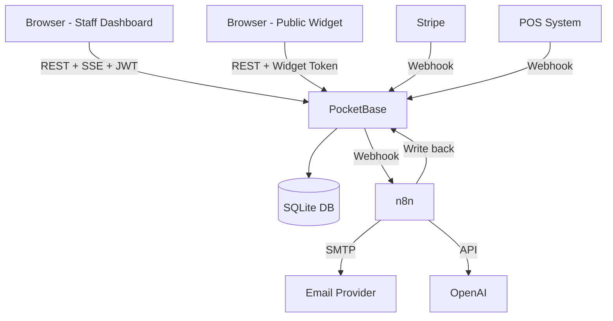

# docs/ARCHITECTURE.md — System Architecture

_Last updated: 2026-03-21 — Reflects SaaS v2.0 target architecture_

---

## High-Level Overview (v2.0 SaaS Target)

```
┌───────────────────────────────────────────────────────────────────────┐
│                           Tenants (Browsers)                          │
│                                                                       │
│  Restaurant A Dashboard    Restaurant B Dashboard    Booking Widget   │
│  (staff, manager)          (staff, manager)          (public iframe)  │
│         │                         │                        │          │
└─────────┼─────────────────────────┼────────────────────────┼──────────┘
          │ REST + SSE              │ REST + SSE             │ REST
          │ JWT auth                │ JWT auth               │ public token
          └─────────────┬───────────┘────────────────────────┘
                        │
┌───────────────────────▼───────────────────────────────────────────────┐
│                           PocketBase                                  │
│                                                                       │
│   ┌────────────┐  ┌──────────┐  ┌────────────┐  ┌────────────────┐  │
│   │  REST API  │  │ Auth/JWT │  │  SSE/Sub.  │  │   Admin UI     │  │
│   │  /api/...  │  │  Users   │  │  Realtime  │  │   /_/          │  │
│   └─────┬──────┘  └──────────┘  └────────────┘  └────────────────┘  │
│         │                                                             │
│   ┌─────▼──────────────────────────────────────────────────────────┐ │
│   │                     SQLite Database                            │ │
│   │  users | restaurants | restaurant_settings | tables |          │ │
│   │  reservations | customers | reservation_logs                   │ │
│   │                                                                │ │
│   │  Row-level isolation: all queries filter by restaurant_id      │ │
│   └────────────────────────────────────────────────────────────────┘ │
└───────────────────────────────────────────────────────────────────────┘

┌───────────────────────────────────────────────────────────────────────┐
│                        Automation Layer                               │
│                                                                       │
│   ┌───────────────────────────────────────────────────────────────┐  │
│   │                         n8n                                   │  │
│   │  Workflow 1: Reservation Confirmation (email/SMS)             │  │
│   │  Workflow 2: 24h Reminder                                     │  │
│   │  Workflow 3: Incoming Message Handler (WhatsApp/email)        │  │
│   │  Workflow 4: AI Classification (OpenAI)                       │  │
│   │  Workflow 5: No-show Scoring (v2)                             │  │
│   └──────┬───────────────────────────────┬───────────────────────┘  │
└──────────┼───────────────────────────────┼───────────────────────────┘
           │                               │
    PocketBase webhooks              OpenAI API / LLM
    (reads + writes)                 (AI classification)

┌───────────────────────────────────────────────────────────────────────┐
│                     Future: Billing & Integrations                    │
│                                                                       │
│   Stripe (subscriptions)     Square/Toast POS     Analytics Engine   │
└───────────────────────────────────────────────────────────────────────┘
```

---

## v1.0 Architecture (Current — Single Tenant)

```
Browser
  └── Frontend Dashboard (Vanilla JS + SVG)
        └── PocketBase REST API (http://localhost:8090)
              └── SQLite (1 restaurant, all data)

n8n (http://localhost:5678)
  ├── Triggered by PocketBase webhooks
  └── Calls OpenAI API
```

The v1.0 architecture works for a single self-hosted restaurant. The `restaurant_id` field is already on all entities, making the v2 row-level isolation upgrade non-breaking.

---

## v2.0 Architecture Changes

| Concern | v1.0 | v2.0 |
|---|---|---|
| Authentication | None (URL-based) | PocketBase users + JWT roles |
| Multi-tenancy | Single restaurant | N restaurants, row-level isolation |
| Floor plan updates | 60s polling | PocketBase SSE subscriptions |
| Business rule enforcement | Client-side only | PocketBase hooks + collection rules |
| Restaurant config | Hardcoded | `restaurant_settings` collection |
| Booking | Staff-only dashboard | + Public booking widget |
| Analytics | None | Occupancy, no-show, peak hours |

---

## Database Schema (v2.0 additions)

### Existing Collections (v1.0)
- `restaurants` — id, name, created, updated
- `tables` — id, restaurant_id, number, capacity, area, x, y, shape, active
- `reservations` — id, restaurant_id, table_id, customer_id, guest_name, guest_email, guest_phone, party_size, reserved_at, duration_minutes, status, source, notes
- `customers` — id, restaurant_id, name, email, phone, visit_count, last_visit, notes
- `reservation_logs` — id, reservation_id, restaurant_id, action, previous_status, new_status, actor_id, note

### New Collections (v2.0)
- `users` — id, email, password_hash, name, role (`superadmin`|`restaurant_admin`|`staff`), restaurant_id (nullable for superadmin), active
- `restaurant_settings` — id, restaurant_id, timezone, default_duration_minutes, min_gap_minutes, opening_time, closing_time, logo_url, primary_color, booking_widget_enabled, booking_widget_token
- `subscription_plans` — id, name, max_tables, max_reservations_per_month, price_monthly, stripe_price_id
- `restaurant_subscriptions` — id, restaurant_id, plan_id, stripe_subscription_id, status, current_period_end

---

## Multi-Tenancy Model

TableFlow uses **row-level multi-tenancy**: all tables share one SQLite database, and every row is tagged with `restaurant_id`.

```
PocketBase Collection Rule (example — reservations):
  List:   @request.auth.restaurant_id = restaurant_id
  View:   @request.auth.restaurant_id = restaurant_id
  Create: @request.auth.restaurant_id != "" && @request.body.restaurant_id = @request.auth.restaurant_id
  Update: @request.auth.restaurant_id = restaurant_id
  Delete: @request.auth.role = "restaurant_admin" && @request.auth.restaurant_id = restaurant_id
```

Users are linked to exactly one restaurant (except `superadmin` users who can see all restaurants).

---

## Data Flow: Creating a Reservation (v2.0)

```
1. Staff logs in → frontend stores JWT token
2. Frontend loads floor plan: GET /api/collections/tables/records
   (PocketBase rule filters by auth token's restaurant_id automatically)
3. Staff clicks table → table detail modal shows upcoming reservations
4. Staff opens "Nueva Reserva" form
5. Form validates: 3-hour gap (client-side first, then server-side hook)
6. Frontend POST /api/collections/reservations/records (with JWT)
7. PocketBase hook: validates gap server-side, logs event, increments customer.visit_count
8. PocketBase SSE notifies all subscribed clients → floor plan updates instantly
9. n8n Workflow 1: sends confirmation email/SMS
10. n8n schedules Workflow 2 (24h reminder)
```

## Data Flow: Public Booking Widget

```
1. Restaurant enables widget in settings → gets embed token
2. Widget iframe loads on restaurant website
3. Guest selects date/time/party → widget queries availability
4. Guest submits: POST /api/collections/reservations/records?source=widget
   (authenticated with widget token — scoped to one restaurant, create-only)
5. PocketBase creates reservation (status=pending)
6. n8n sends confirmation to guest
7. Staff sees new pending reservation in dashboard (via SSE)
```

---

## Data Flow: AI Message Classification

```
1. Incoming reservation message (email, SMS, WhatsApp)
2. n8n Workflow 3 receives webhook from message provider
3. n8n calls OpenAI with message + system prompt
4. OpenAI returns: { intent, date, time, party_size, name, phone, restaurant_id }
5. If intent == "new_reservation": n8n creates reservation in PocketBase (status=pending)
6. If intent == "cancellation": n8n updates existing reservation status=cancelled
7. n8n sends confirmation to the sender
```

---

## Security Model (v2.0)

| Layer | Control |
|---|---|
| Transport | HTTPS (nginx/Caddy reverse proxy in production) |
| Authentication | PocketBase JWT tokens (30-day expiry) |
| Authorization | PocketBase collection rules: `@request.auth.restaurant_id = restaurant_id` |
| Tenant isolation | Row-level `restaurant_id` filter on ALL queries |
| Secrets | Environment variables only — never in code or git |
| Rate limiting | Nginx rate limiting on `/api/collections/reservations/records` POST |
| CORS | Restricted to known frontend origins in production |
| Input validation | Client-side (UX) + PocketBase hooks (enforcement) |

---

## Real-time Architecture (v2.0)

Replace the current 60-second polling with PocketBase SSE subscriptions:

```javascript
// Frontend: subscribe to reservations for this restaurant
pb.collection("reservations").subscribe("*", (e) => {
    if (e.action === "create" || e.action === "update") {
        refreshFloorPlan();
    }
});
```

PocketBase broadcasts change events to all subscribed clients of the same restaurant. No polling needed.

---

## Scalability Path

| Scale | Solution |
|---|---|
| 1–100 restaurants | Single PocketBase instance (SQLite) — works great |
| 100–1000 restaurants | PocketBase + PostgreSQL backend (drop-in swap) |
| 1000+ restaurants | Sharded PocketBase instances by region, load balanced |
| Booking widget traffic spikes | CDN-cached availability endpoint + dedicated read replica |

SQLite with PocketBase handles ~10k concurrent connections read-heavy. For most restaurant SaaS, this scale is sufficient for years.

---

## Mermaid Architecture Diagram


